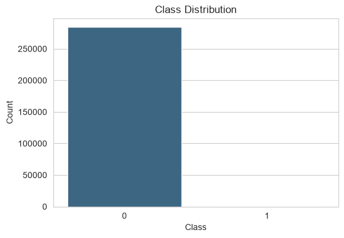
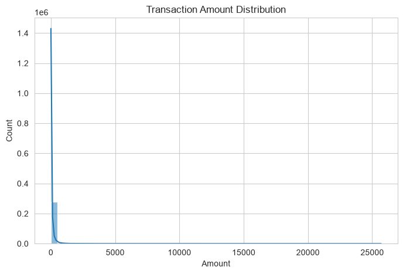
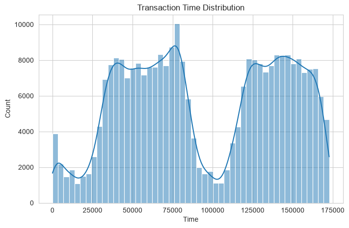
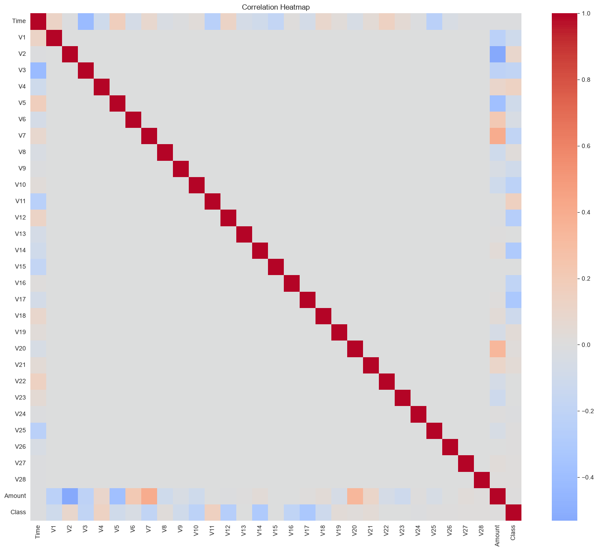
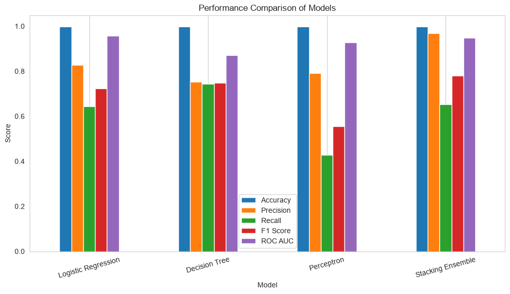
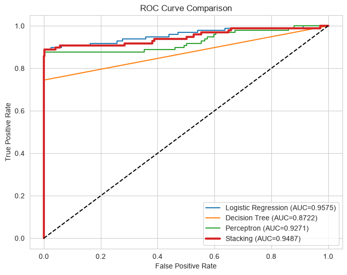
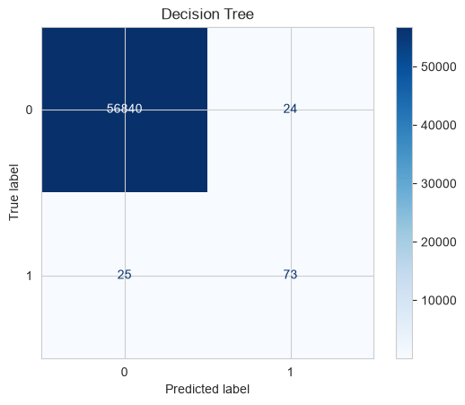
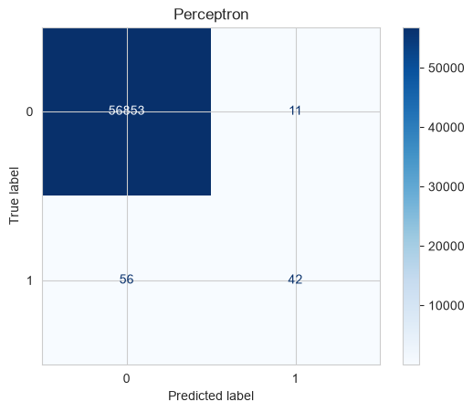
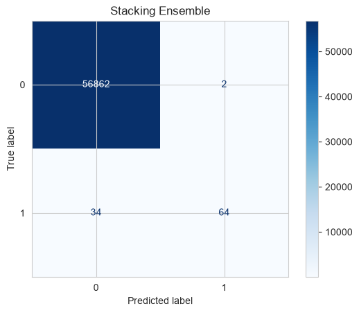

# Credit Card Fraud Detection Using Stacking Ensemble Learning


---

## Overview

This project implements a **manual Stacking Ensemble Learning** model for credit card fraud detection using the [Credit Card Fraud Detection dataset](https://www.kaggle.com/datasets/mlg-ulb/creditcardfraud) from Kaggle. Instead of using Scikit-learn's built-in `StackingClassifier`, the stacking algorithm is implemented manually to demonstrate the complete ensemble learning process.

The ensemble combines three base classifiers:

- Logistic Regression
- Decision Tree
- Calibrated Perceptron

A **Logistic Regression** model is used as the meta-learner.

---

## Objective

To develop and evaluate a manual Stacking Ensemble using 5-fold Stratified Cross-Validation and compare its performance with individual classifiers using Accuracy, Precision, Recall, F1-score, and ROC-AUC.

---

## Dataset

**Credit Card Fraud Detection Dataset**

| Property | Value |
|---|---|
| Source | [Kaggle — mlg-ulb/creditcardfraud](https://www.kaggle.com/datasets/mlg-ulb/creditcardfraud) |
| Total Transactions | 284,807 |
| Fraud Cases | 492 (0.17%) |
| Features | 30 numerical (V1–V28 + Time + Amount) |
| Task | Binary Classification |

> **Note:** The dataset is not included in this repository due to its size (143 MB).
> Download `creditcard.csv` from Kaggle and place it in the `data/` directory before running the notebook.

### Class Distribution



### Transaction Amount Distribution



### Transaction Time Distribution



### Feature Correlation Heatmap



---

## Project Structure

```
credit-card-fraud-stacking-ensemble/
├── data/                                      # Dataset directory (not tracked in git)
│   └── creditcard.csv                         # Download from Kaggle
├── images/                                    # Plots exported from the notebook
│   ├── 01_class_distribution.png
│   ├── 02_transaction_amount_distribution.png
│   ├── 03_transaction_time_distribution.png
│   ├── 04_correlation_heatmap.png
│   ├── 05_confusion_matrix_logistic_regression.png
│   ├── 06_confusion_matrix_decision_tree.png
│   ├── 07_confusion_matrix_calibrated_perceptron.png
│   ├── 08_roc_curves_base_models.png
│   ├── 09_confusion_matrix_stacking_ensemble.png
│   ├── 10_performance_comparison_bar_chart.png
│   └── 11_roc_curve_comparison_all_models.png
├── notebook/
│   └── ensemble_stacking.ipynb               # Main analysis notebook
├── requirements.txt
├── .gitignore
└── README.md
```

---

## Workflow

1. Data Loading
2. Exploratory Data Analysis (EDA)
3. Data Preprocessing
4. Feature Scaling
5. Stratified Train-Test Split
6. Train Base Models
   - Logistic Regression
   - Decision Tree
   - Calibrated Perceptron
7. Evaluate Base Models
8. Manual Stacking
   - 5-Fold Stratified Cross-Validation
   - Out-of-Fold Predictions
   - Meta-Feature Generation
9. Train Logistic Regression Meta-Model
10. Final Evaluation
11. Performance Comparison

---

## Models

| Model | Role |
|---|---|
| Logistic Regression | Base model + Meta-learner |
| Decision Tree | Base model |
| Calibrated Perceptron | Base model |
| **Stacking Ensemble** | Final model |

---

## Results

| Model | Accuracy | Precision | Recall | F1-score | ROC-AUC |
|---|---:|---:|---:|---:|---:|
| Logistic Regression | 0.9992 | 0.8289 | 0.6429 | 0.7241 | **0.9575** |
| Decision Tree | 0.9991 | 0.7526 | **0.7449** | 0.7487 | 0.8722 |
| Calibrated Perceptron | 0.9988 | 0.7925 | 0.4286 | 0.5563 | 0.9271 |
| **Stacking Ensemble** | **0.9994** | **0.9697** | 0.6531 | **0.7805** | 0.9487 |

### Key Findings

- Stacking Ensemble achieved the **highest Accuracy, Precision, and F1-score**
- Logistic Regression achieved the highest ROC-AUC
- Decision Tree achieved the highest Recall

### Performance Comparison



### ROC Curve Comparison



### Confusion Matrices — Base Models

| Logistic Regression | Decision Tree | Calibrated Perceptron |
|---|---|---|
|  |  |  |

### Confusion Matrix — Stacking Ensemble



---

## Getting Started

### 1. Clone the repository

```bash
git clone https://github.com/21Oli/credit-card-fraud-stacking-ensemble.git
cd credit-card-fraud-stacking-ensemble
```

### 2. Install dependencies

```bash
pip install -r requirements.txt
```

### 3. Download the dataset

Download `creditcard.csv` from [Kaggle](https://www.kaggle.com/datasets/mlg-ulb/creditcardfraud) and place it in the `data/` directory:

```
data/
└── creditcard.csv
```

### 4. Run the notebook

Open `notebook/ensemble_stacking.ipynb` in Jupyter and run all cells.

---

## Evaluation Metrics

- Accuracy
- Precision
- Recall
- F1-score
- ROC-AUC
- Confusion Matrix
- ROC Curve

---

## Technologies Used

- Python
- Pandas
- NumPy
- Matplotlib
- Seaborn
- Scikit-learn
- Jupyter Notebook
